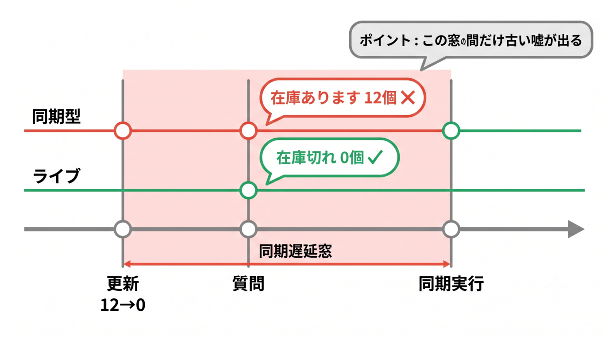
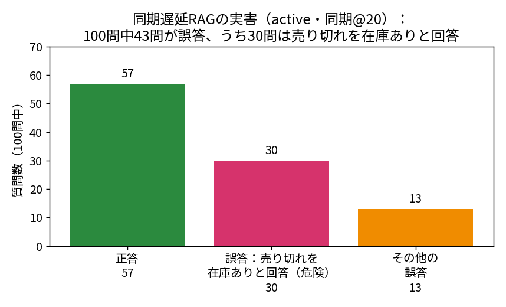
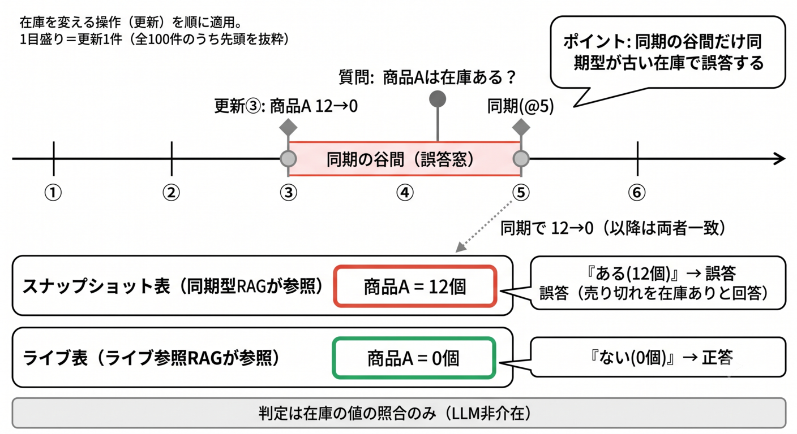
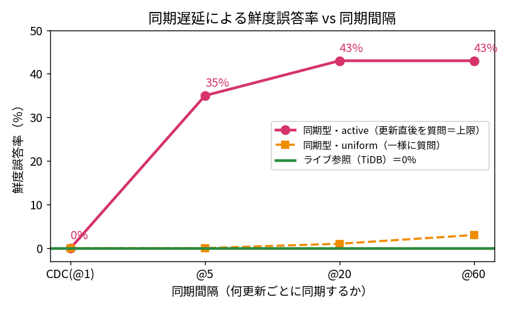
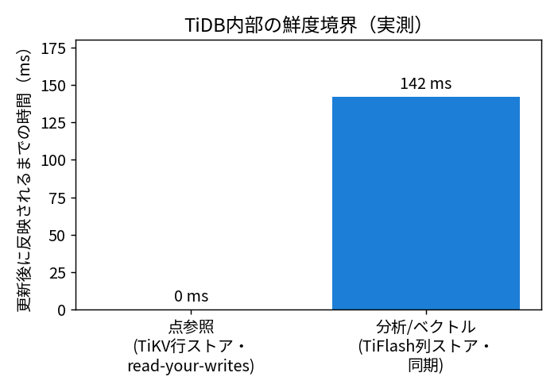
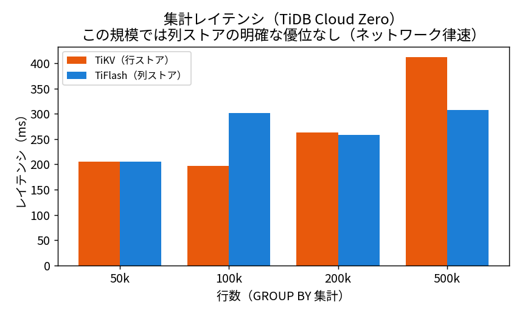
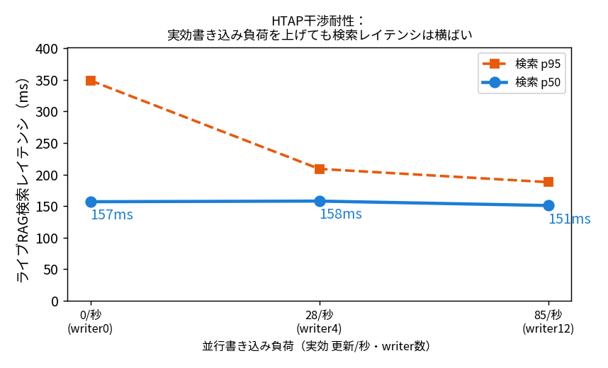
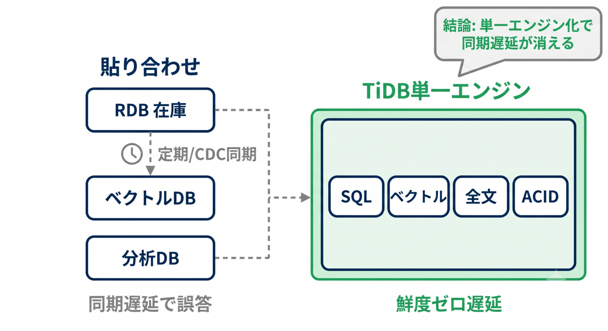

## はじめに

:::message
Zenn コンテスト「TiDBで作るAI時代のデータ基盤」(PingCAP) 応募作。
**手を動かして得た一次情報**と**測り方**をまとめた実装ノートです。
誇張を避け、**TiDBが有利でなかった部分も正直に**載せます。
全コード・データ・再現手順は末尾で公開しています。
:::

## この記事で得られるもの（3つの持ち帰り）

業務データに答えるRAGを TiDB で実装する中で、**ドキュメントには載っていない一次情報**（公式ドキュメントに無い、実際に動かして初めて分かった事実）と、RAGの鮮度を**定量評価する方法論**が貯まりました。
本記事の中身はこの3つです。

1. **RAGの鮮度を"測る"方法論**（「鮮度誤答率」を質問分布 × 同期間隔の関数として計測）
2. **日本語全文検索の落とし穴と設計レシピ**（`MULTILINGUAL` パーサは形態素解析ではない）
3. **TiDBの「鮮度境界」の実測**（点参照は即時 / TiFlash 列ストアは ≈142ms の同期遅延）

> 結論の一部（「データと埋め込みを単一エンジンに置けば鮮度は保てる」）は**単一エンジン一般の性質**で、TiDB固有ではありません（§5で切り分けます）。本記事の狙いは"TiDBの優位を示すこと"ではなく、**実装の一次情報と鮮度の測り方**を共有することです。

### この記事の前提

本文で使う用語を最小限だけ先に定義します。

- **RAG**：LLMが回答する前に、DBから関連情報を検索して渡す仕組み（Retrieval-Augmented Generation）。
- **ベクトル検索 / 埋め込み**：テキストを数値の並び（＝埋め込み）に変換し、「意味の近さ」で検索する手法。
- **全文検索**：単語のキーワード一致で引く検索（§3で日本語の落とし穴を扱う）。
- **CDC**：Change Data Capture。DBの更新イベントを検知して別システムへ流す仕組み。§2の「同期@1」はこれに相当する理想ケース。
- **TiDB / TiDB Cloud Zero**：MySQL互換のサーバーレス分散DB。**1つのDBで SQL＋ベクトル検索＋全文検索＋トランザクション（複数の処理をまとめて確実に反映する性質、ACID）** が書ける。**TiDB Cloud Zero** は `curl` 1発・サインアップ不要で立つ無料の使い捨てクラスタ（本記事の全検証はこれで実施）。
- **HTAP（行ストア TiKV / 列ストア TiFlash）**：書き込み・点参照に強い行ストア(TiKV)と、集計・分析に強い列ストア(TiFlash)を**1つのDBに同居**させる仕組み。
- **p50 / p95**：レイテンシ（応答時間）の分布指標。p50＝中央値（半数がこれより速い）、p95＝95パーセンタイル（95%がこれより速い＝「遅い側の代表値」）。§5で検索レイテンシの評価に使う。
- **点参照**：主キーなどで1件のレコードを直接引く読み取り（例：商品IDで在庫を取得）。TiDBでは行ストア(TiKV)が担当し、更新が即時に反映される。
- **RTT（ネットワーク往復時間）**：クライアントからDBへ往復する通信時間。クラウドDBへのクエリ遅延の多くはこれが占める（本記事の計測値にも含まれる）。
- **本記事が比較する2構成**：
  - **同期型RAG**：ベクトルDBとRDBを**別々に**持ち、定期/CDCで同期する一般的な構成 → 同期の遅れで古くなる。
  - **ライブ参照RAG**：データと埋め込みを**同じDB**に置き、常に最新を参照する構成。


## この記事の検証マップ（先に全体像）

TiDB Cloud Zero 上で行った検証は5つです。結論を先に地図にすると：

| # | 検証 | 何を測ったか | 主な結果 | 節 |
|---|---|---|---|---|
| ① | 鮮度誤答率 | 同期型 vs ライブの「古い答え」率（質問分布×同期間隔） | 上限ケースで同期型 最大**43%**誤答 / ライブ**0%** | §1-2 |
| ② | 日本語全文検索 | `MULTILINGUAL` パーサの日本語ヒット精度 | 漏れ・誤ヒット多発（英数字は正確）→ 役割分担で回避 | §3 |
| ③ | 鮮度境界 | 更新が各ストアに反映されるまでの時間 | 点参照(TiKV)は**即時** / 列(TiFlash)は **≈142ms** | §4 |
| ④ | HTAP集計速度 | 行 vs 列の集計レイテンシ（50k–500k行） | この規模では**優位なし**（差が出なかった＝null結果） | §5 |
| ⑤ | 干渉耐性 | 並行更新を流しながらの検索レイテンシ | 実効 **~85更新/秒**でも検索 p50 は横ばい | §5 |

①②③は実装で得た一次情報、④はHTAP集計で優位が出なかったnull結果、⑤は並行更新下での干渉耐性の確認です。以降この順に説明します。


## 1. なぜ「鮮度」が問題なのか

ある商品が**完売した直後**に、同じ質問を「定期同期型RAG」と「ライブ参照RAG」に投げた、**本検証デモの実行ログ**です。

```
👤 商品5は在庫ありますか？
❌ 同期型（VectorDB+RDBを定期同期）: 「はい、12個在庫があります」 ← 古い。もう売り切れ
✅ ライブ参照:                      「在庫切れ（0個）です」      ← 正しい
```


*図1: 在庫が0になってから次の同期までの「誤答窓」。この窓の間だけ同期型は古い在庫を返す。*

LLMもプロンプトも悪くありません。**検索基盤が古いデータを返している**だけ（stale RAG）。そして実害は無視できません。「**更新直後の商品を必ず聞く**」＝鮮度が最も問われる**上限ケース**で計測したところ：


*図2: 鮮度感度の上限ケースで100問中43問が古い答え。うち30問は「売り切れを“在庫あり”と偽答」。*

- 100問中 **43問が誤答**、うち **30問**は「実在庫0なのに“在庫あり”と答える」危険な向き（判定基準：スナップショットの在庫>0 かつ 実在庫=0）。
- ※ この43%は「変化した項目を狙って聞く」**上限ケース**。一様にカタログを聞くと0〜3%（後述）。実運用のクエリ分布はこの**間**に乗ります。

> 「鮮度は基盤の問題」だと分かったら、次に必要なのは**それをどう測るか**です。


## 2. RAGの鮮度を“測る”：鮮度誤答率という方法論

漠然と「同期遅延は悪」と言う代わりに、**測定可能な指標**に落とします。

### 定義（原因をLLMから切り離す）
> **鮮度誤答率** = 同一質問を同時刻に「同期型」「ライブ」へ投げ、**ライブが正答 かつ 同期型が誤答**の割合。検索ロジック・埋め込み・乱数シードを**両者で完全固定**し、差分を同期遅延に帰属させる。

※ ここでの「同時刻」は実時間の並行処理ではなく、**更新イベントと質問を1本の時間軸に並べて順に再生する決定的リプレイ**での同一地点（＝同じ更新適用数）を指します。同期型とライブに**同じ系列を別々に流して**比較するため、差は同期遅延だけに帰属します。実時間で更新を流しながら測る並行検証は§5（干渉耐性）で扱います。

重要な点として、**本実験の誤答判定は「スナップショット在庫>0 かつ 実在庫=0」のデータ照合で決まり、LLMは介在しません**。＝鮮度の誤りは**検索層だけで決まる**ことを示しています（生成の良し悪しの問題ではない）。判定の核はこれだけです：

```python
got = read_stock(table, pid)         # table = products_live / products_snapshot
true_stock = truth[applied][pid]     # その時点の“真の”在庫
wrong = (got > 0) != (true_stock > 0)
```

### 実験設定（何を・どう測ったか）
- **データ**：商品80件のカタログ（在庫・説明・カテゴリ）。決定的に生成（シード固定で再現可能）。
- **更新**：在庫数をランダムに変える操作を100件、決定的な順序で適用（在庫切れ＝0を多めに含む）。
- **質問**：100件。「この商品の在庫はある？」を次の2通りの**当て方**で自動生成し、各時点の真の在庫と照合。
  - **uniform（下限）**：全商品から一様にランダムに聞く（在庫変化とは無相関）。
  - **active（上限ケース）**：**更新直後の商品を必ず聞く**構成。「在庫が動いた直後に確認する」行動が100%集中した**理論的な上限**で、実利用そのものではなく"鮮度が最も問われる最悪寄り"のケース。
- **同期間隔（`@N` の意味）**：同期型が「**N件の更新ごとに1回まとめて同期する**」設定を `@N` と表記し、`@1`（毎更新＝CDC相当の理想）/ `@5` / `@20` / `@60` と変えて比較します。`N` が大きいほど同期が疎になり、データは古くなりやすくなります（更新が毎分数件なら `@20` はおおむね数分間隔に相当）。
- **在庫の読み取り方式**：在庫確認は **点参照（TiKV 行ストア）** で読む（更新直後でも最新が返る＝read-your-writes。詳細は§4）。「ライブ参照」が0%になるのはこのため。なおTiFlash経由の分析・大規模ベクトル読みには別の鮮度境界（≈0.1s級、§4）がある。

### ライブ表 / スナップショット表とは（＋@5の具体例）

2つの表は、それぞれ**2つのRAGアーキテクチャが見るデータ源**です。

- **ライブ表（`products_live`）**：ライブ参照RAGのデータ。更新が即反映され常に最新。
- **スナップショット表（`products_snapshot`）**：同期型RAGのデータ。`@N` 更新ごとにライブ表からコピーされ、同期と同期の谷間は古いまま。

実システムでは、**同期型RAGのLLMはスナップショット表を、ライブ参照RAGのLLMはライブ表を**参照して回答します。ただし「在庫があるか」は表の値で決まり、LLMの巧拙では変わりません。そこで§2では**LLMを外し、両表の在庫を“真の在庫”と直接照合**して誤答を数えます（鮮度の誤りが検索層だけで決まることを示すため）。

**具体例（@5の場合）**：

1. 更新③で商品Aが 12→0（売り切れ）。
2. 同期は5更新ごと（`@5`）なので、次の同期は更新⑤。更新③〜⑤の谷間、スナップショット表はまだ「12個」。
3. この谷間で「商品Aは在庫ある？」と来ると、同期型＝「ある(12個)」＝**誤答** / ライブ＝「ない(0個)」＝正答。
4. 更新⑤で同期が走ると、スナップショット表も「0」になり、以降は両方正答。

この「同期の谷間で古い答えを返す窓」が誤答の正体です（図3）。`@N` が大きいほど谷間が広がり、誤答が増えます（図4）。


*図3: @5での一例（横軸の1目盛り＝在庫を変える更新1件。更新は全100件あり、図は先頭6件を抜粋）。更新③で商品Aが 12→0。次の同期（更新⑤）までの谷間に質問が来ると、同期型RAG（スナップショット表）は「12個」と誤答し、ライブ参照（ライブ表）は「0個」と正答する。更新⑤で同期されると両者一致。判定は在庫の値の照合のみ（LLM非介在）。*


*図4: 同期間隔が広いほど誤答増。上限ケース(active)で顕著。ライブ参照は常に0%。*

| 条件 | uniform（無相関＝下限） | **active（上限ケース）** |
|---|---|---|
| ライブ参照 | **0.0%** | **0.0%** |
| 同期@1（CDC理想） | 0.0% | 0.0% |
| 同期@5 | 0.0% | **35.0%** |
| 同期@20 | 1.0% | **43.0%** |
| 同期@60 | 3.0% | **43.0%** |

> **実分布は uniform(下限) と active(上限) の間**に乗ります。例えば「クエリの30%が更新直後の確認」なら誤答率 ≈ 0.3×43% ≈ **13%**（混合の試算）。自サービスのクエリログをこの軸で分類すれば、自分の鮮度リスクの露出度を見積もれます。

### この測定から導ける洞察
1. **鮮度誤答率 ＝「同期間隔 × 質問が更新と相関するか」の関数**。
   - 補足：active で @5=35% → @20以降=43% と頭打ちになるのは、更新100件が質問期間内にほぼ出尽くし、**同期間隔が「質問対象が変化する間隔」を超えると誤答が飽和する**ため（43%はこの設定での天井）。
2. **CDC(@1) ≈ ライブ**：毎更新同期すれば鮮度差はほぼ消える。ただしCDCは同期パイプラインの運用・コストを伴う。
3. **持ち帰り（方法論）**：自分のRAGでも「同一質問を“ライブ版”と“同期版”に同時投入し、ライブ正答かつ同期誤答率」を測れば、鮮度リスクをLLM品質と切り離して定量化できる。


## 3. 一次情報①：日本語全文検索の限界と設計レシピ

ここからは、実際に動かして分かった挙動です。TiDB の `FULLTEXT ... WITH PARSER MULTILINGUAL` は、**日本語の形態素解析ではありません**（形態素解析＝日本語の文を意味のある最小単位に分割する処理。例：「渋谷区」→「渋谷」「区」。これがないと語の境界を正しく取れず、検索の漏れ・誤ヒットが起きます）。実測した不安定挙動：

| 検索語 | 期待 | 実際 |
|---|---|---|
| 防災 | 「渋谷区の防災…」に一致 | **不一致（漏れ）** |
| 渋谷 | 「渋谷区…」に一致 | **不一致（漏れ）** |
| 渋谷区 | 渋谷区のみ | **新宿区も誤ヒット** |
| 子育て / お知らせ | 該当 | ✅ 一致 |

漏れと誤ヒットが同時に起きます。一方、**英数字トークン（SKU・型番・エラーコード）は正確にヒット**します。

なぜか（観察からの推測）：日本語は単語を空白で区切らない（分かち書きがない）ため、`MULTILINGUAL` パーサが**語の境界を正しく取れていない**と見られます。英数字（SKU・型番）は空白やハイフンで自然に区切られるため安定してヒットします。
※内部仕様は[公式ドキュメント](https://docs.pingcap.com/tidbcloud/vector-search-full-text-search-sql/)で最新を確認してください（ここでは実測挙動と設計判断を示します）。

```sql
-- 英数字(SKU/型番)なら正確にヒット。観測上、fts_match_word は小文字・WHERE 内で使う。
SELECT product_id, name FROM products
WHERE fts_match_word('SKU-1234', description);
```

### 設計レシピ
- **日本語の自然文 → ベクトル検索**に寄せる（意味で引く）。
- **全文検索は英数字（SKU・型番・カテゴリ記号・エラーコード）に限定**する。
- `fts_match_word('語', カラム)` は **小文字**。 **計測時点では WHERE 内で他の条件（述語）と組み合わせ／多重使用するとエラー(1221)** になりました（公式は WHERE＋ORDER BY での関連度順の例を示すため、利用形態は上記docで要確認）。
- ベクトル列・全文インデックスは **TiFlash レプリカが前提**。`AUTO_RANDOM`（主キーにランダム値を自動採番し、書き込みの集中を避けるTiDBの機能）主キーとの併用は可。


## 4. 一次情報②：TiDBの「鮮度境界」を実測する

「単一エンジンならいつでも最新」と言っても、 **どこまで即時で、どこから遅延するか** が実装では効きます。前提として、TiDB は同じテーブルを **行ストア(TiKV)＝書き込み・点参照用** と **列ストア(TiFlash)＝分析・大規模ベクトル用** の両方で保持します（HTAP）。鮮度の振る舞いはこの2つで異なります。


*図5: HTAPの二重保持。同じ1件のデータ（例：商品Aの在庫）が、行ストア(TiKV)と列ストア(TiFlash)の両方に保持される。更新はまず行ストアに即時反映され、列ストアへは少し遅れて同期される。この「読む場所による反映タイミングの差」が、次に測る鮮度境界の正体。*

スキーマはこう書きます：

（リポジトリの `sql/schema_rt.sql` は同期比較用に `products_live` / `products_snapshot` の2表。下は要点を1表に簡略化。明示的IDで投入するため主キーは `AUTO_RANDOM` ではなく素の `BIGINT PRIMARY KEY`。）

```sql
CREATE TABLE products (
  product_id  BIGINT PRIMARY KEY,
  name        VARCHAR(128),
  stock       INT,
  description TEXT,
  emb         VECTOR(64),                          -- 埋め込み（64次元の数値列）
  FULLTEXT INDEX idx_desc (description) WITH PARSER MULTILINGUAL
);
ALTER TABLE products SET TIFLASH REPLICA 1;                          -- 列ストア(HTAP)
ALTER TABLE products ADD VECTOR INDEX vi ((VEC_COSINE_DISTANCE(emb))) USING HNSW;
```


*図6: 更新後、点参照(TiKV行ストア)は即時。分析/大規模ベクトル(TiFlash列ストア)は ≈142ms の同期。*

- **点参照（TiKV 行ストア）＝即時**。在庫を0に更新した瞬間、検索に反映（read-your-writes＝書き込み直後に読んでも必ず最新値が返る保証。5/5ケースで確認）。update+read 往復は中央値 ≈331ms だが、これは us-west-2 への**ネットワークRTTが大半でエンジン遅延ではない**。
- **TiFlash 列ストアの同期遅延 ≈ 142ms**。

> 測定方法（再現用）：行を更新→`/*+ read_from_storage(tiflash[...]) */` で列ストアを強制し、新しい値が返るまで 100ms 間隔でポーリング→反映時間を記録。**n=3** で ~142ms（粒度100msのため実遅延は数十ms〜）。**1環境・少数回の値**なので絶対値は環境依存。設計には「点参照=即時／分析系=~0.1s級」という**桁感**を使ってください。

### ⚠️ §2の「ライブ=0%」との整合（重要）
厳密には **「ライブ参照」もゼロ遅延ではありません**。TiFlash 経由のベクトル/全文読み取りには、上で測った **~0.1s 級の鮮度境界**があります。§2で 0% になったのは、在庫質問を **点参照(TiKV)** で測ったため、かつ質問間隔が同期窓より十分長かったためです。したがって正しい比較は：

> **ライブ ＝ ~0.1s 級の鮮度境界** vs **同期型 ＝ 分〜時間オーダーの同期間隔**（本検証の同期間隔は「更新N件ごと」で定義。更新が毎分数件なら@20は数分間隔に相当）── すなわち **桁違い（更新レート次第で概ね3桁規模）の差**

が本記事の定量的な主張となります。
「鮮度ゼロ遅延」は点参照の即時性を指し、分析系には上記の境界がある、と理解してください。

### 設計指針
- 「在庫ある？」のような**鮮度がシビアな点参照は行ストア（TiKV）に寄せる**＝即時。
- **大規模ベクトル検索・分析集計は列ストア（TiFlash）経由で ~0.1s 級の同期**を許容する前提で設計する。
- 最新状態 × 意味検索を1クエリで（直前に在庫0化した商品は即除外）：

```sql
SELECT product_id, name, stock,
       VEC_COSINE_DISTANCE(emb, ?) AS dist   -- ?=質問文の埋め込み。distが小さいほど意味が近い
FROM products
WHERE stock > 0                  -- 今この瞬間の在庫（read-your-writes）
ORDER BY dist ASC LIMIT 5;       -- 意味が近い順に5件
```

> 注意：`WHERE` で絞り込みつつ `ORDER BY VEC_COSINE_DISTANCE` する場合、HNSW（近似近傍探索アルゴリズム）インデックスが効くかは絞り込みの選択率やバージョンに依存します。本検証規模ではフルスキャンでも問題ありませんが、大規模時は `EXPLAIN` で実行計画（インデックス利用の有無）を確認してください。

## 5. 設計判断：単一エンジンにするか（なぜTiDBか）

- 図4で見た**鮮度の勝ちは「単一エンジン化」の勝ち**であって、**TiDB固有ではありません**。元データと同じDBにベクトルを置けば、Postgres+pgvector でも同じ図が描けます。
- では TiDB を選ぶ理由（測定の裏付けがある範囲）：
  1. **分散・サーバーレスでの read-your-writes 保証**：`curl` 1発の使い捨てクラスタ（TiDB Cloud Zero）で、ベクトル＋全文＋SQL＋ACID＋点参照の即時性が1接続で揃う（同期ジョブも別OLAPも不要）。
  2. **1ステートメントで「最新状態フィルタ × ベクトル × 全文」** が書ける（貼り合わせ不要・§4のSQL）。
  3. **将来スケール時に同じSQLのまま HTAP/水平スケールへ拡張できる**（再アーキ不要）。

### HTAP優位を測ったが、本検証規模では出なかった
「列ストアなら大規模集計が速いはず」と期待し、50k〜500k行で集計レイテンシを測りました。


*図7: GROUP BY 集計。この規模・環境では列ストアの明確な優位は出ず（速度比はノイズ域）。*

| 規模 | TiKV(行) | TiFlash(列) | 速度比（TiKV÷TiFlash, >1で列優位） |
|---|---|---|---|
| 50,000 | 205ms | 205ms | 1.0x |
| 100,000 | 197ms | 301ms | 0.7x（列が遅い）|
| 200,000 | 263ms | 259ms | 1.0x |
| 500,000 | 412ms | 308ms | 1.3x |

- **本検証の規模・環境では HTAP の明確な優位は出ませんでした**。
原因：集計が軽く（GROUP BY 5カテゴリ）、レイテンシは**ネットワークRTT支配**（200-400ms）、無料クラスタの小規模 TiFlash。
- よって本記事は **「TiDBはHTAPで速い」とは主張しません**。
HTAP の優位は数百万行・重い分析の領域で、本検証の範囲外（将来の検討事項）。優位が出なかった結果もそのまま記載しています。

### 干渉耐性：並行更新下でも検索レイテンシは劣化しなかった
集計の絶対速度では差が出ませんでしたが、HTAPの本質は **「書き込み(OLTP)と分析・ベクトル読み(OLAP)が互いに干渉しないこと」** です。そこで主題に直結する形で、 **在庫更新を並行で流しながらライブRAG検索のレイテンシ(各条件 n=40回)を測りました** 。単一接続のwriter（書き込みを送る側）はネットワークRTT律速で毎秒数件しか書けないため、 **writerを並列接続(4/12スレッド)にして実効書き込みレートを実測で 0→28→85 updates/秒まで引き上げて** 比較しています。


*図8: 実効書き込み負荷を 0→28→85 updates/秒へ上げても、ライブRAG検索の p50 は横ばい（157→158→151ms）、p95 も劣化しない。*

| 実効書き込み（実測） | 検索 p50 (n=40) | 検索 p95 (n=40) |
|---|---|---|
| 0 updates/秒（writer 0本） | 157ms | 349ms |
| 27.6 updates/秒（writer 4本） | 158ms | 209ms |
| 84.8 updates/秒（writer 12本） | 151ms | 188ms |

→ **実効~85更新/秒の並行書き込み下でも、検索 p50 は横ばい・p95 も悪化しませんでした**。「更新が流れ続ける中で常に最新を返す」という本記事の主題に沿う挙動で、行ストアへの書き込みと列ストア/点参照の読みが干渉しないことを示します。
> 注記：無負荷(0/秒)で p95 が 349ms と最も高いのは、計測順で最初の条件だったため、**接続やキャッシュが温まる前（コールドスタート）** の影響を含むためで、負荷をかけた条件では p95 はむしろ 188〜209ms に収まりました。要点は **「実効~85更新/秒まで上げても読みレイテンシが悪化しない」** こと。数百更新/秒級の高負荷での検証は今後の課題です。


*図9: 「貼り合わせ」構成（左, 同期遅延あり）と単一エンジン（右）。「鮮度ゼロ遅延」は点参照の即時性を指す（分析系は§4の鮮度境界）。*

### （任意）mem9 でユーザー文脈を記憶しパーソナル化する
TiDB上に構築されたエージェント向け長期記憶 **mem9** を併用すると、ライブ在庫の回答に「ユーザーの関心・過去の問い合わせ」を反映できます（本記事の主題＝鮮度とは別軸ですが、TiDBエコシステムの一例）。

```python
from expagent.mem9 import Mem9
mem = Mem9()                                          # MEM9_API_KEY で有効化（api.mem9.ai or self-host）
mem.store("渋谷区在住・防災と子育てに関心。以前ワイヤレスイヤホンを問い合わせ", labels=["user-profile"])
ctx = mem.search("おすすめの在庫あり商品は？")          # 質問に関連する記憶を想起
# → ライブ在庫(TiDB, 最新) + ctx(mem9, ユーザー文脈) を LLM に渡してパーソナル回答を生成
```

実際に `MEM9_API_KEY` を設定して動かした実ログ（抜粋）：

```
mem9 store  -> {'status': 'accepted'}
mem9 search -> {'memories': [{'content': 'The user is interested in disaster prevention
                and child-rearing information.', 'memory_type': 'insight', ...}]}
【mem9なし（在庫のみ）】 在庫が潤沢な商品1/4/5/8 のいずれかをおすすめ
【mem9あり（在庫＋文脈）】 防災・育児に関心があり渋谷区にお住まいの方へ。商品7（在庫3・日用品）がおすすめ
```

ここでも**一次情報**が2つ：
1. mem9 は入力を**事実抽出して正規化**して保存する（日本語の文脈 → `memory_type: insight` の英語知見に変換。検索は日本語クエリでも横断ヒット）。
2. **store 直後の検索は空で、数秒後に検索可能**になった ── mem9 にも「書き込み→索引化」の遅延境界があり、**本記事の鮮度テーマと符合**します（store は `{'status':'accepted'}`＝非同期受理）。

> **鮮度の主結果（§2〜4）は mem9 非依存**です。mem9 はパーソナル化の付加価値として併用しています。

## 6. 運用知見と検証環境

### ハマりどころ
- **使い捨てクラスタ**：`curl -s -X POST https://zero.tidbapi.com/v1beta1/instances -d '{"tag":"demo"}'` で host/user/pass が即返る。
※エンドポイント/パスは変わりうる（**2026-06時点で `v1beta1/instances` 動作確認**）。インスタンスは30日で失効、Claim（自分のアカウントへ引き取る操作）で永続DBに昇格可。
- **接続耐性**：長時間運用ではDB接続のアイドル切断が起きる → **ping再接続＋例外時リトライ**を実装すべき（本検証でも実際に切断に遭遇）。
- **TiFlash レプリカ前提**：ベクトル/全文インデックスは列ストアレプリカが要る。INSERT直後は列ストア反映に遅延。

### 検証環境（再現性のため固定）
- **TiDB**：`SELECT tidb_version()` = **v8.5.3-serverless** / TiDB Cloud Zero / リージョン **us-west-2** / 計測 **2026-06**。
- **商品の埋め込み**：`rt.py` の決定的ハッシュ **64次元**（schema は `VECTOR(64)`）。鮮度・HTAP計測は**埋め込みAPI不要**（無料・再現的）。
- **デモ(§1)の回答生成**：Vertex AI **Gemini 2.5 Flash-lite**（temperature=0）。鮮度誤答の判定自体はLLM非依存（§2）。
- **mem9**：ホスト版 `api.mem9.ai`（v1alpha2 API）で store/search を**動作確認済**（2026-06）。
- ※ マネージドサービスのため挙動は変わりうる。特に日本語全文の挙動は将来改善余地（本記事は2026-06時点の実測）。

## 7. 本検証の範囲と限界

- 「同期型」は定期/CDC同期構成の**挙動を再現した実装**（実際の外部ベクトルDB製品（Pinecone等）を使ったものではない）。
- 鮮度の勝ちは「単一エンジン化」によるもの（§5）。本記事は TiDB の性能優位を主張しない。
- **HTAP の性能優位は本検証の規模では出なかった**（§5）。
- デモは小規模・軽量埋め込み（64次元・商品80）。誤答率は「傾向」「上限ケース」として提示。
- 本記事の「鮮度」は**同一データの同期遅延による古さ（staleness）**を指す。「どの文書を根拠にしてよいか（正本性・参照資格）」というガバナンスの論点は**別レイヤー**で本記事の範囲外。


## 8. 結論

- **RAGの鮮度は LLM ではなく“基盤の鮮度”の問題**であり、**測れる**（鮮度誤答率：上限ケースで43%、その多くは“売り切れを在庫ありと偽る”危険な向き。実分布は0〜43%の間）。
- **単一エンジン化で鮮度誤答は最小化**できる（点参照は即時、分析系も ~0.1s 級＝同期型の分〜時間オーダーに対し桁違い）。これは単一エンジン化の効果（TiDB固有ではない）。
- TiDB の実利は **サーバーレスの手軽さ＋1ステートメント統合＋拡張余地**。HTAP は集計の絶対速度では本検証規模で差が出なかったが、**実効~85更新/秒の並行書き込み下でも検索レイテンシが劣化しない（干渉耐性）を確認**（§5）。
- 実装で本当に効くのは **日本語全文の設計レシピ**と **鮮度境界（点参照=即時 / 列ストア≈142ms）** という一次情報。

**チェックリスト（“単一エンジンRAG”が向くか）**

| 質問 | Yes が多いほど向く |
|---|---|
| ユーザーは「今の状態（在庫・ステータス）」を聞くか？ | □ |
| データは頻繁に更新されるか？ | □ |
| VectorDB+RDB+同期 の運用が重いと感じるか？ | □ |
| サーバーレスで小さく始めて拡張したいか？ | □ |

### この記事を実務に使うなら（次の一歩）
1. **まず自分のRAGで鮮度誤答率を測る**：同一質問を「ライブ版」「同期版」に同時投入し `ライブ正答 かつ 同期誤答` の割合を出す（§2の方法を流用）。
2. **全文検索に日本語の自然文を入れているなら設計を見直す**：日本語はベクトル、英数字(SKU/型番)は全文（§3）。
3. **鮮度がシビアな点参照は行ストア（即時反映）に寄せる**（§4）。

発展：本番規模でのHTAP検証、（次の検証候補）Sudachi/MeCabで分かち書きした影カラムに全文インデックスを張り日本語ヒットを実測、mem9 によるユーザー文脈のパーソナル化。


## 再現リポジトリ
- コード・スキーマ・計測スクリプト・生成グラフ一式： **https://github.com/yujmatsu/tidb-realtime-rag** 
- `scripts/rt_freshness.py`（鮮度誤答率）/ `rt_harm.py`（実害内訳）/ `rt_primary.py`（鮮度境界）/ `rt_htap_scale.py`（HTAP集計）/ `rt_interference.py`（干渉耐性）/ `rt_demo.py`（NL会話）/ `rt_demo_mem9.py`（mem9連携）/ `rt_charts.py`（図）
- 再現の一本道：`curl` でZero起動 → `.env` 設定 → `rt_freshness.py` → `rt_charts.py`（README参照）

